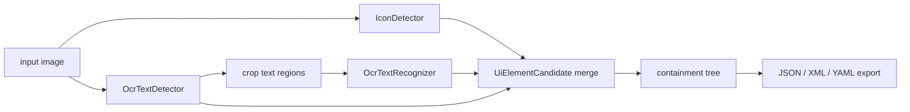

# UIparserCV

UIparserCV là dự án C++20 để phân tích ảnh chụp giao diện người dùng và xuất ra cây cấu trúc UI.

Pipeline mục tiêu:

```text
ảnh input
  -> icon detector
  -> OCR detector + recognizer
  -> thuật toán merge box / containment tree bằng C++
  -> UI tree: JSON, XML, YAML, ...
```

## Tech Stack

- C++20
- GCC từ MSYS2 UCRT64, dùng `g++`
- CMake
- OpenCV nếu cần cho đọc ảnh, tiền xử lý, debug trực quan
- Icon detection: model icon detector từ Microsoft OmniParser, ưu tiên format ONNX
- OCR: PP-OCRv6 tiny/small ONNX detection và recognition models

Dependency sẽ ưu tiên cài bằng MSYS2 `pacman` nếu có package phù hợp. Nếu `pacman` không có, dependency có thể được kéo local vào `vendor/`, `external/`, hoặc một thư mục tương tự sau khi được duyệt.

## Trạng Thái Hiện Tại

Repo đang ở giai đoạn dựng nền và thử từng component độc lập trước khi ráp pipeline.

Đã có:

- CMake project C++20.
- Core module đầu tiên cho box containment tree.
- Inference module C++ cho ONNX Runtime + OpenCV, tách riêng khỏi core tree.
- Wrapper độc lập cho icon detector, OCR detector, OCR recognizer.
- Probe kiểm tra thuật toán tree và xuất JSON mẫu.
- Probe kiểm tra đường dẫn model.
- Probe kiểm tra OpenCV đọc ảnh.
- Probe chạy các component inference trên ảnh smoke test.
- Synthetic UI corpus generator: sinh vài chục ảnh UI giả lập kèm ground truth JSON để regression test detector/tree/debug overlay.
- CLI pipeline đầu tiên: `uiparsercv_pipeline.exe`.

Đã kiểm tra local:

- `g++` hoạt động.
- `cmake` hoạt động.
- OpenCV được tìm thấy qua `pkg-config opencv4`.
- ONNX Runtime được tìm thấy qua `pkg-config libonnxruntime`, package MSYS2 UCRT64 hiện là `1.26.0`.
- `ui_tree_probe` pass qua CTest.
- `component_probe` chạy icon detector, OCR detector, OCR recognizer trên ảnh test tự tạo.
- `uiparsercv_pipeline.exe` chạy end-to-end trên ảnh demo UI, xuất JSON gồm stats, candidates, và containment tree.
- `onnxruntime_probe` khởi tạo được ONNX Runtime và load được một ONNX model nhỏ tạo tạm trong `build/tmp`.
- PP-OCRv6 tiny ONNX det/rec đã được tải về `models/ocr` từ nguồn official PaddleOCR/Paddle model ecology và chạy dummy inference thành công.
- PP-OCRv6 small ONNX det/rec đã được tải về.
- Default OCR combo hiện là `tiny_det + small_rec`: detect nhanh, recognition tốt hơn tiny.
- Icon detector ONNX đã được đặt ở `models/icon_detect/model.onnx` và chạy dummy inference thành công.
- Icon detector defaults follow Microsoft OmniParser Gradio defaults: confidence threshold `0.05`, NMS/IoU threshold `0.1`, image size `640`.
- `opencv_probe` đọc được ảnh mẫu 2x2.
- `model_file_probe` pass với đủ icon model, OCR det model, OCR rec model.

## Layout Model Dự Kiến

Mặc định project tìm model ở:

```text
models/
  icon_detect/
    model.onnx
  ocr/
    ppocrv6_tiny_det.onnx
    ppocrv6_tiny_det.yml
    ppocrv6_tiny_rec.onnx
    ppocrv6_tiny_rec.yml
    ppocrv6_small_det.onnx
    ppocrv6_small_det.yml
    ppocrv6_small_rec.onnx
    ppocrv6_small_rec.yml
    ppocrv6_medium_det.onnx
    ppocrv6_medium_det.yml
    ppocrv6_medium_rec.onnx
    ppocrv6_medium_rec.yml
```

Có thể override khi configure:

```powershell
cmake -S . -B build `
  -DUIPARSERCV_ICON_MODEL=C:/path/to/icon_detect/model.onnx `
  -DUIPARSERCV_OCR_DET_MODEL=C:/path/to/ppocrv6_tiny_det.onnx `
  -DUIPARSERCV_OCR_REC_MODEL=C:/path/to/ppocrv6_small_rec.onnx `
  -DUIPARSERCV_OCR_REC_CONFIG=C:/path/to/ppocrv6_small_rec.yml
```

Model ONNX hiện được giữ trong repo để người khác clone về có thể chạy smoke test/pipeline ngay.

## Build

Trong shell có MSYS2 UCRT64 toolchain trên PATH:

```powershell
cmake -S . -B build
cmake --build build
```

Nếu muốn chỉ định Ninja:

```powershell
cmake -S . -B build -G Ninja
cmake --build build
```

## Chạy Kiểm Thử

```powershell
ctest --test-dir build --output-on-failure
```

Hiện tại CTest chạy `ui_tree_probe`, kiểm tra quan hệ chứa nhau giữa các UI box mẫu.
Khi OpenCV và ONNX Runtime có sẵn, CTest cũng chạy `component_probe` để kiểm tra các wrapper inference.
Khi OpenCV có sẵn, CTest cũng chạy `synthetic_ui_corpus` để sinh bộ ảnh UI test vào `build/testdata/synthetic_ui`.

## Component Probes

### Tree Merge Probe

Không cần OpenCV hay model:

```powershell
.\build\tools\ui_tree_probe.exe
```

Probe tạo vài box mẫu, dựng containment tree, kiểm tra cấu trúc, rồi in JSON.

### ONNX Runtime Probe

Kiểm tra ONNX Runtime có load được model không:

```powershell
.\build\tools\onnxruntime_probe.exe path\to\model.onnx
```

Probe có thể nhận nhiều model cùng lúc, ví dụ cặp OCR:

```powershell
.\build\tools\onnxruntime_probe.exe models\ocr\ppocrv6_tiny_det.onnx models\ocr\ppocrv6_tiny_rec.onnx
```

Hoặc kiểm tra combo small:

```powershell
.\build\tools\onnxruntime_probe.exe models\ocr\ppocrv6_small_det.onnx models\ocr\ppocrv6_small_rec.onnx
```

Chạy inference smoke test bằng tensor zero:

```powershell
.\build\tools\onnxruntime_probe.exe --run-dummy models\ocr\ppocrv6_tiny_det.onnx models\ocr\ppocrv6_tiny_rec.onnx
```

Nếu chạy không kèm model path, probe chỉ in ONNX Runtime API version.

Trên Windows có thể có `onnxruntime.dll` khác trong `C:\Windows\System32`. Dev build hiện copy DLL của MSYS2 UCRT64 vào cạnh `onnxruntime_probe.exe` để Windows loader dùng đúng bản runtime.

### Model File Probe

Kiểm tra model files đã nằm đúng chỗ chưa:

```powershell
.\build\tools\model_file_probe.exe
```

Probe này chưa chạy inference. Nó chỉ xác nhận wiring đường dẫn model.

### OpenCV Probe

Được build khi CMake tìm thấy OpenCV:

```powershell
.\build\tools\opencv_probe.exe path\to\screenshot.png
```

Probe đọc ảnh và in metadata cơ bản như width, height, channels, depth.

### Synthetic UI Corpus

Sinh bộ ảnh UI giả lập cố định kèm ground truth JSON:

```powershell
.\build\tools\synthetic_ui_corpus.exe build\testdata\synthetic_ui 36
```

Output gồm:

- `manifest.json`: danh sách test case.
- `synthetic_*.png`: ảnh UI giả lập.
- `synthetic_*.json`: metadata ground truth gồm `role`, `text`, `interactive`, `rect`, và quan hệ `parent`.

Bộ này dùng để phát triển/tuning pipeline theo vòng lặp trực quan: chạy pipeline trên ảnh synthetic, render overlay, rồi so với ground truth trước khi chỉnh heuristic merge tree hoặc postprocess OCR.

### Component Probe

Chạy icon detector, OCR detector, và OCR recognizer qua API wrapper C++:

```powershell
.\build\tools\component_probe.exe
```

Có thể truyền ảnh thật:

```powershell
.\build\tools\component_probe.exe path\to\screenshot.png
```

## Pipeline CLI

Chạy pipeline hoàn chỉnh và xuất JSON:

```powershell
.\build\uiparsercv_pipeline.exe path\to\screenshot.png --out output.json
```

Xuất thêm ảnh debug overlay và metadata tree/box:

```powershell
.\build\uiparsercv_pipeline.exe path\to\screenshot.png `
  --out output.json `
  --debug-image output.overlay.png `
  --debug-meta output.meta.txt
```

Output JSON hiện gồm:

- `image`: kích thước ảnh.
- `stats`: số icon, text regions, candidates.
- `candidates`: danh sách `UiElementCandidate` sau khi merge icon/text.
  - `text`: text dùng để hiển thị/label hiện tại.
  - `raw_text`: text OCR gốc.
  - `normalized_text`: text sau lớp postprocess.
- `tree`: containment tree dựng từ candidates.

Debug overlay vẽ box theo node id trong tree. Metadata text ghi lại cùng id, rect, kind, score, text, source, và quan hệ cha-con để đối chiếu nhanh khi tuning detector/OCR/tree.

CLI hiện là bản JSON-first/debug-first để dễ validate trước khi thêm XML/YAML.

Có thể override model ở runtime để so sánh nhanh mà không cần configure/build lại:

```powershell
.\build\uiparsercv_pipeline.exe path\to\screenshot.png `
  --ocr-det-model models\ocr\ppocrv6_small_det.onnx `
  --ocr-rec-model models\ocr\ppocrv6_small_rec.onnx `
  --ocr-rec-config models\ocr\ppocrv6_small_rec.yml `
  --out out\small_small.json `
  --debug-image out\small_small.overlay.png `
  --debug-meta out\small_small.meta.txt
```

### Model Combo Compare

Chạy 3 combo OCR chuẩn trên cùng một ảnh và xuất JSON/overlay/meta cho từng combo:

```powershell
.\build\tools\model_combo_compare.exe capture.png out\model_combo_capture
```

Combo hiện có:

- `tiny_det_tiny_rec`
- `tiny_det_small_rec`
- `small_det_small_rec`
- `medium_det_medium_rec`

Tool này dùng cùng pipeline C++ và cùng debug overlay, phù hợp để chọn default model bằng mắt trước khi có benchmark định lượng.

## Module Dự Kiến

```text
src/
  image/        đọc ảnh và tiền xử lý
  detect/       tích hợp icon detector
  ocr/          tích hợp PP-OCRv6 detection / recognition
  infer/        wrapper ONNX Runtime dùng chung
  tree/         merge box và containment tree bằng C++
  export/       JSON / XML / YAML
  app/          command-line entry points
```

Nguyên tắc triển khai là giữ từng module chạy được độc lập trước, rồi mới ráp thành pipeline hoàn chỉnh.

## Pipeline Shape

Pipeline chính nên chỉ điều phối các component, không chứa chi tiết preprocess/postprocess:



Schema trung gian hiện là `UiElementCandidate`: `kind`, `box`, `detection_score`, `text`, `text_confidence`, `interactive`, `source`. Kiểu này đủ đơn giản để debug bằng log/JSON, nhưng vẫn mở rộng được khi thêm caption, role, hoặc state.

## Các Điểm Cần Chốt

- OCR DB postprocess hiện bám PaddleOCR C++ flow và dùng Clipper offset cho `unclip`.
- Candidate merge bám logic OmniParser `remove_overlap_new`: text boxes được ưu tiên, icon hấp thụ text nằm bên trong, icon nằm trong text bị bỏ.
- UI tree hiện có semantic grouping heuristic nhẹ: gom input bar theo hàng dài ở nửa trên màn hình, và gom button icon+text gần nhau theo cùng hàng.
- Heuristic grouping được tách riêng ở `pipeline/tree_grouper`, để pipeline runner chỉ điều phối detector/OCR/merge/export.
- OCR text postprocess đã tách thành lớp riêng, giữ cả raw và normalized text trong candidate JSON.
- Format export đầu tiên: JSON nên đi trước vì dễ validate và dễ dùng cho tooling. XML/YAML có thể thêm sau khi schema UI tree ổn định.

## Model Sources

- PP-OCRv6 tiny ONNX detection: `PP-OCRv6_tiny_det_onnx_infer.tar`
- PP-OCRv6 tiny ONNX recognition: `PP-OCRv6_tiny_rec_onnx_infer.tar`
- PP-OCRv6 small ONNX detection: `PP-OCRv6_small_det_onnx_infer.tar`
- PP-OCRv6 small ONNX recognition: `PP-OCRv6_small_rec_onnx_infer.tar`
- PP-OCRv6 medium ONNX detection: `PP-OCRv6_medium_det_onnx_infer.tar`
- PP-OCRv6 medium ONNX recognition: `PP-OCRv6_medium_rec_onnx_infer.tar`

Các link này được PaddleOCR docs liệt kê trong phần Android deployment cho PP-OCRv6 tiny/small ONNX.
